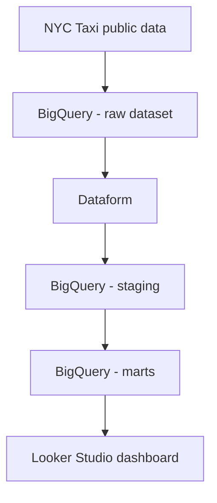

# demo-dataform-nyc-taxy

## Architecture

Architecture Cible

### Vue d’ensemble



### Composants

- **NYC Taxi public data** : source de données publique.
- **BigQuery - raw dataset** : zone d’atterrissage des données brutes.
- **Dataform** : transformation, modélisation et orchestration SQL.
- **BigQuery - staging** : couche intermédiaire nettoyée et normalisée.
- **BigQuery - marts** : tables métier prêtes pour l’analyse.
- **Looker Studio dashboard** : visualisation des indicateurs.

## Socle Terraform

Le dossier `iac/` lit la configuration depuis `conf/manifest.yaml` et
`conf/env/<env>.yaml`, puis déploie :

- les APIs GCP nécessaires ;
- les datasets BigQuery `raw`, `staging`, `marts` et `assertions` ;
- un service account dédié à Dataform ;
- un repository Dataform ;
- un workspace de développement Dataform ;
- une release config Dataform ;
- un workflow config Dataform planifié tous les jours ;
- les rôles IAM minimaux pour lire le raw et écrire dans process/marketplace.

Le workflow Dataform est une ressource Dataform visible dans l'onglet
`Versions et programmation`. Ce n'est pas un Google Cloud Workflow, donc il n'y
a pas de fichier sous `components/dataform/resources/workflows` pour cette
planification.

Avant le premier `plan`, vérifier les IDs projet dans `conf/env/dev.yaml` et
`conf/env/prod.yaml`.

- dev : `aqueous-heading-496010-q7`
- prod : `clean-avatar-496010-v8`

```bash
cd iac
terraform init \
  -backend-config="bucket=<bucket-state-terraform>" \
  -backend-config="prefix=demo-dataform-nyc-taxy/dev"
terraform validate
terraform plan -var="env=dev"
```

## Ingestion Parquet sans CSV

Le projet est configuré pour utiliser les fichiers Parquet officiels NYC TLC :

```text
https://d37ci6vzurychx.cloudfront.net/trip-data/yellow_tripdata_YYYY-MM.parquet
```

Terraform déploie :

- un bucket GCS en `europe-west9` pour stocker les Parquet ;
- un Cloud Run Job qui télécharge les fichiers TLC vers GCS ;
- un chargement BigQuery `bq load` vers la table raw `yellow_trips_source` en
  location `EU` ;
- un Cloud Scheduler quotidien pour relancer l'ingestion.

Dataform lit ensuite uniquement la table raw locale en `EU`, puis produit les
tables `staging` et `marts` pour Looker Studio. Cela évite les CSV et évite les
requêtes directes cross-location vers un dataset public BigQuery en `US`.

## Prochaines tâches

1. Vérifier ou ajuster l'ID projet dans `conf/env/dev.yaml`.
2. Configurer le backend GCS Terraform.
3. Lancer `terraform plan -var="env=dev"`.
4. Si le repository Dataform doit être connecté à Git, ajouter une version de
   secret contenant la deploy key puis passer `dataform_enable_git_remote` à
   `true`.
5. Lancer manuellement le Cloud Run Job d'ingestion une première fois.
6. Exécuter le workflow Dataform pour produire `staging` et `marts`.

Après `terraform apply`, l'ingestion initiale peut être lancée avec :

```bash
gcloud run jobs execute crj-dev-nyctaxi-ingest \
  --project=aqueous-heading-496010-q7 \
  --region=europe-west9 \
  --wait
```

Pour prod :

```bash
gcloud run jobs execute crj-prod-nyctaxi-ingest \
  --project=clean-avatar-496010-v8 \
  --region=europe-west9 \
  --wait
```
