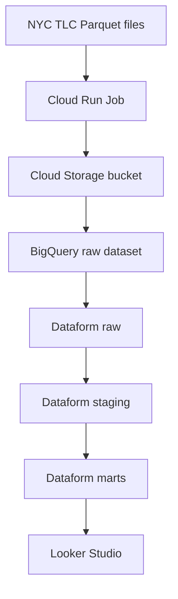

# demo-dataform-nyc-taxy

Pipeline Dataform et Terraform pour construire une chaîne analytique NYC Yellow Taxi sur Google Cloud.

Le projet provisionne l'infrastructure GCP, ingère les fichiers Parquet officiels NYC TLC dans BigQuery, puis transforme les données avec Dataform jusqu'aux tables de marts prêtes pour Looker Studio.

## Architecture



## Contenu du dépôt

```text
.
├── components/dataform/       # Templates YAML des ressources Dataform
├── conf/                      # Configuration globale et par environnement
├── definitions/               # Définitions SQLX Dataform
│   ├── raw/                   # Normalisation raw depuis la table d'ingestion
│   ├── staging/               # Nettoyage et typage métier
│   └── marts/                 # Tables analytiques et assertions
├── iac/                       # Point d'entrée Terraform
├── includes/                  # Constantes Dataform
├── modules/                   # Modules Terraform réutilisables
└── workflow_settings.yaml     # Configuration Dataform Core
```

## Fonctionnalités

- Provisioning GCP avec Terraform.
- Activation des APIs nécessaires.
- Création des datasets BigQuery `raw`, `staging`, `marts` et `assertions`.
- Création d'un repository, workspace, release config et workflow config Dataform.
- Ingestion Parquet via Cloud Run Job et Cloud Scheduler.
- Modélisation Dataform en couches `raw`, `staging` et `marts`.
- Assertion Dataform sur les montants négatifs.

## Prérequis

- Google Cloud SDK authentifié sur les projets cibles.
- Terraform installé localement.
- Accès à un bucket GCS pour le backend Terraform.
- Droits GCP suffisants pour activer des APIs, créer des ressources BigQuery, Cloud Run, Cloud Scheduler, Storage, IAM et Dataform.

## Configuration

Les paramètres globaux sont dans [conf/manifest.yaml](conf/manifest.yaml).

Les environnements sont séparés dans :

- [conf/env/dev.yaml](conf/env/dev.yaml)
- [conf/env/prod.yaml](conf/env/prod.yaml)

Avant de déployer, vérifier au minimum :

- les IDs des projets GCP ;
- le bucket de backend Terraform ;
- le repository GitHub et la branche cible ;
- la valeur `dataform_enable_git_remote` selon la présence d'une deploy key dans Secret Manager.

## Déploiement Terraform

Depuis le dossier `iac/` :

```bash
terraform init \
  -backend-config="bucket=<bucket-state-terraform>" \
  -backend-config="prefix=demo-dataform-nyc-taxy/dev"

terraform validate
terraform plan -var="env=dev"
terraform apply -var="env=dev"
```

Pour la production, utiliser un préfixe de state distinct et `env=prod`.

## Ingestion initiale

Après le premier `terraform apply`, lancer le job d'ingestion une première fois.

Dev :

```bash
gcloud run jobs execute crj-dev-nyctaxi-ingest \
  --project=aqueous-heading-496010-q7 \
  --region=europe-west9 \
  --wait
```

Prod :

```bash
gcloud run jobs execute crj-prod-nyctaxi-ingest \
  --project=clean-avatar-496010-v8 \
  --region=europe-west9 \
  --wait
```

Le scheduler relance ensuite l'ingestion automatiquement selon la configuration de l'environnement.

## Exécution Dataform

Le workflow Dataform est créé dans la ressource Dataform, visible dans l'onglet **Versions et programmation** de Google Cloud.

Dataform produit :

- `yellow_trips_001` en raw ;
- `stg_yellow_trips_001` et `stg_taxi_zones_001` en staging ;
- `fct_trips_001`, `dim_taxi_zone_001` et `mart_daily_trips_001` en marts ;
- `assert_positive_amounts` comme contrôle qualité.

## Validation locale

```bash
terraform fmt -recursive
terraform -chdir=iac validate
npx dataform compile
```

`terraform validate` nécessite un `terraform init` préalable. `npx dataform compile` nécessite l'accès au package Dataform Core.

## Données source

Le pipeline utilise les fichiers Parquet officiels NYC TLC :

```text
https://d37ci6vzurychx.cloudfront.net/trip-data/yellow_tripdata_YYYY-MM.parquet
```

Les données sont copiées dans un bucket GCS en `europe-west9`, puis chargées dans une table BigQuery raw en location `EU`. Dataform lit ensuite uniquement la table locale, ce qui évite les requêtes cross-location vers des datasets publics en `US`.

## Notes de sécurité

- Les fichiers d'état Terraform, plans et dossiers `.terraform/` sont exclus du dépôt.
- Les secrets, deploy keys et credentials GCP ne doivent pas être commités.
- La connexion Git du repository Dataform dépend d'une deploy key stockée dans Secret Manager.
